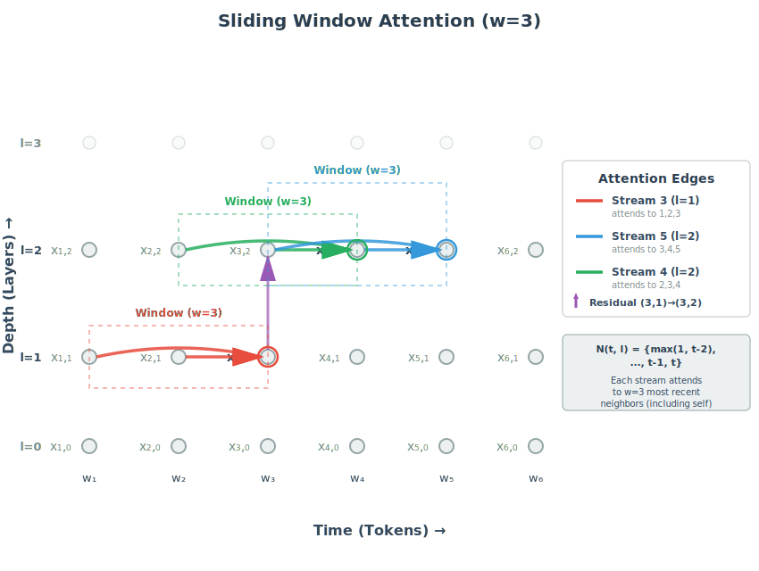

# Information Flow Graphs: A Unifying Lens for Transformers and Efficient Attention

## 1. Introduction

How do Transformers - the models that underpin modern LLMs - actually work under the hood? And how
can we make them faster? These are central questions in modern AI research, particularly in the
subfields of mechanistic interpretability, attention variant design, and sparsity. The goal of this
article is to bridge the gulf between introductory material and the rapidly evolving frontier of
these fields, and deepen readers' intuition on Transformer internals and attention variants.

In particular, our (perhaps ambitious) thesis is: despite the diversity of
ideas in this space, <span style="color: #007bff">**a handful of mental models
and metaphors is sufficient to understand the research frontier**</span>.

To this end, we hope to explore the following ideas in this and future articles. (If some of these terms are unfamiliar, that's expected - we'll develop each from first principles.)

* <span style="color: #007bff">**Transformer models**</span> as <span style="color: #2ecc71;">*defining information flow through a grid graph*</span>
* <span style="color: #007bff">**Residual Streams**</span> as <span style="color: #2ecc71;">*fixed-bandwidth information highways*</span>
* <span style="color: #007bff">**Transformer Layers**</span> as a sequence of <span style="color: #2ecc71;">*collaborating actors with immediate and long-term goals*</span>
* <span style="color: #007bff">**Ordinary Attention**</span> as a particular implementation of an <span style="color: #2ecc71;">*abstract interface for cross-stream
  causal communication*</span>
* <span style="color: #007bff">**QK and OV circuits**</span> as determinants of <span style="color: #2ecc71;">*where* information flows and <span style="color: #2ecc71;">*what* information flows respectively
* <span style="color: #007bff">**Attention Heads**</span> as <span style="color: #2ecc71;">*low-rank, additive updates*</span> that write into subspaces of the
  residual stream
* <span style="color: #007bff">**Several attention variants**</span> as <span style="color: #2ecc71;"> *connectivity-preserving static or dynamic
  sparsification*</span> of the underlying information-flow graph
* <span style="color: #007bff">**Kernelized Attention** as defining a <span style="color: #2ecc71;">*factor graph*</span> mediating cross-stream communication

---

## 2. Prerequisites and Notes on Style

<span style="color: #007bff;">**Prerequisites**</span>

This article assumes you're comfortable with the basics of the transformer architecture,
particularly causal self-attention. If you need a refresher, we recommend [Andrej Karpathy's video](https://www.youtube.com/watch?v=kCc8FmEb1nY), [3Blue1Brown's video](https://www.youtube.com/watch?v=wjZofJX0v4M), and [The Illustrated Transformer](https://jalammar.github.io/illustrated-transformer/) as excellent starting points.

<span style="color: #007bff;">**Scope**</span>

We focus exclusively on causal, decoder-only transformers (like GPT-style models). Throughout this article, "attention" or "ordinary attention" refers to the standard causal self-attention mechanism used in these models, whereas attention variants will use additional qualifiers (e.g. "sliding
window attention").

<span style="color: #007bff;">**Inspiration**</span>

This article is heavily inspired by [Anthropic's Mathematical Framework for
Transformer Circuits](https://transformer-circuits.pub/2021/framework/index.html). One of our goals
is to provide a gentler onramp to some of the deep technical insights expounded in that work.

<span style="color: #007bff;">**Caveats**</span>

Our emphasis is on building intuition rather than mathematical rigor or implementation details. To this end, we take the following liberties:
- Omit architectural and implementation details that don't change the core story (like
normalizers, regularizers, numerical issues, etc.)
- Liberally anthropomorphize (introducing "actors" that "want" information, etc.)
- Depict parallel computations as serial when it aids understanding.

<span style="color: #007bff;">**Notation**</span>

We'll use the following notation throughout. Our working model will be a causal, decoder-only
transformer with $L$ layers, hidden dimension $D$, and context length $T$. We'll denote input tokens
by $w_1, \ldots, w_T$, and use $x_{t,l}$ to denote the representation of token $t$ at the input to layer $l$. We
use 1-indexing for tokens and 0-indexing for layers; $x_{t,0}$ denotes the representation of the
$t$th token entering the layer 0 (i.e. after token embedding and positional embedding).

---

## 3. The Transformer as a Grid of Information Flow

### <span style="color: #007bff;"> 3.1 Introducing the Grid View </span>
Our core frame will be to view transformers in terms of information flowing through a grid. The
two axes of this grid are time (tokens) and depth (layers). Each node $(t, l)$ on the grid
represents the state of token $t$ at the start of layer $l$, which we denote $x_{t,l}$.


<span style="color: #007bff;">**Rows as Layers**</span>

A horizontal row in our grid corresponds to a transformer layer. Layers are the computational units
we typically think about in deep learning: a model is a composition of several layers. Each
transformer layer is composed of three core operations:

1. Attention - the core focus of this article.
2. MLP - a shallow feedforward neural network.
3. Normalizers and regularizers, like LayerNorm, dropout, and others. While important, we will omit these from all equations and descriptions here for brevity, as they don't change our core explanations.

<span style="color: #007bff;">**Columns as Residual Streams**</span>

A vertical column corresponds to a single token being processed across layers. We call the $t$-th
column the <span style="color: #007bff;">**residual stream**</span> for token $t$, a term popularized in [Anthropic's original
Transformer Circuits paper](https://transformer-circuits.pub/2021/framework/index.html). The diagram
above depicts the residual stream for the third token, and how information can move forward from
previous streams into this stream via attention.

A key frame we'll adopt is a shift from thinking about transformers as stacks of rows (layers),
and instead as a <span style="color: #007bff;">**series of parallel columns**</span>. These columns,
or residual streams, are persistent information channels carrying token representations upwards
through the model.

### <span style="color: #007bff;">**3.2 The Journey of a Single Token**</span>

Given a sequence of input tokens $w_1, \ldots, w_T$, focus on how a single token $w_t$ flows through
its residual stream. 

1. The token enters its stream as the sum of its word <span style="color: #007bff;">**embedding vector**</span> $e_t$ and
   <span style="color: #007bff;">**positional embedding**</span> $p_t$. 

2. Each layer computes an update that is <span style="color: #007bff;">added</span> to the stream - hence the term
   <span style="color: #2ecc71;">residual</span>. The token's representation evolves through a sequence of intermediate states
   $x_{t,0}, x_{t,1}, \ldots, x_{t,L}$.

3. At the final layer, the representation is multiplied by the unembedding matrix to produce logits
   over the vocabulary, which are then normalized into a probability distribution for the next token.

We can thus think of the residual stream as an <span style="color: #007bff;">**information highway**</span>, in which the current
token evolves through a progressive sequence of representations that culminate in a [sufficient statistic](https://www.youtube.com/watch?v=5j4E2FRR384) for
 the distribution of the next token. Importantly, this highway has a <span style="color: #007bff;">fixed bandwidth</span>, dictated by
 the dimensionality $D$ of the residual stream state. 

### <span style="color: #007bff;">**3.3 Residual Actors and Attention as an Interface**</span>

Let's now unpack what happens inside a layer. A metaphor we'll introduce is to imagine an "actor"
associated with each residual stream within a layer, which we'll call a "residual actor." We'll imagine each actor as responsible for implementing the layer update for its stream.  

We can frame the two core operations within a layer as follows:
* Attention as <span style="color: #2ecc71;">*communication*</span> - specifically, actors pulling information from previous actors.

* MLP as solo computation - actors individually performing computation on their own post-attention
  state.

```
# Attention: collaboration step - pull from previous actors at the same layer
$z_{t,l} = x_{t,l} + \text{Attend}(x_{1,l}, x_{2,l}, ..., x_{t,l})$

# MLP: solo step - compute locally on the post-attention state
$x_{t,l+1} = z_{t,l} + \text{MLP}(z_{t,l})$
```

With this framing, a single layer is implemented by multiple *collaborating actors*, using attention
as the <span style="color: #2ecc71;">*interface*</span> for communication.

### <span style="color: #007bff;">**3.4 Collaborating Actors and Goals**</span>
Continuing with the actor metaphor, we ask: what are the goals of each actor? Well, at the end of
the $t$-th residual stream, the model needs to predict the $t+1$-th token $w_{t+1}$. So, the *immediate goal* of actor $t$ is to evolve the representation $x_{t, l}$ towards a representation predictive of the next token. But because *future actors* can also read from actor $t$, it also has a secondary
goal: compute information useful for those future actors.

This framing provides a first-principles view of how models trained for next-token prediction can
actually plan ahead, a phenomenon verified empirically in [work by Anthropic](https://www.anthropic.com/research/tracing-thoughts-language-model).

### <span style="color: #007bff;">**3.5 The grid as a graph**</span>

With this picture in mind, we can make concrete our framing of transformers as a graph.


* <span style="color: #007bff">**Vertical edges**</span> $(t, l) \to (t, l+1)$ represent the
evolution of a token's representation via residual updates between layers.

* <span style="color: #007bff;">**Horizontal edges**</span> $(u, l) \to (t, l)$ represent information flow from earlier to later streams.

(Note: technically there is also an edge from each node to itself. We omit these from diagrams and
from wording like "earlier to later" for brevity.)

In this view, a transformer is a two-dimensional graph of collaborating actors, passing information
forward in time through attention, and upwards in depth through residual updates.

---

## 4. Anatomy of Causal Attention: QK and OV Circuits
We'll now revisit how ordinary attention works, with an emphasis on (a) motivating it from first
principles, and (b) highlighting aspects particularly salient to the frames we're developing. 

### <span style="color: #007bff;">**4.1 Revisiting Ordinary Attention**</span>
To motivate attention, let's put ourselves in the shoes of a single residual actor at $(t, l)$. Our
job in the attention step is to enrich our own state with information from previous streams. We can
break this task down into asking two fundamental questions:

<span style="color: #2ecc71;">*Where should we look?*</span> Among all nodes $u \le t$, which ones are relevant
to me?

<span style="color: #2ecc71;">*What information should I grab?*</span> From each chosen source, what information should I
import?

These questions correspond directly to the roles played by keys, queries, and values.

* <span style="color: #007bff;">**Key ($k_u$)**</span>: each earlier actor $(u, l)$ emits a key vector $k_u$ that broadcasts
  <span style="color: #2ecc71;">"this is the kind of information I have"</span>.

* <span style="color: #007bff;">**Query ($q_t$)**</span>: we emit a query vector $q_t$ that encodes <span style="color: #2ecc71;">what kind of information we
  want</span>.

* <span style="color: #007bff;">**Value ($v_u$)**</span>: each earlier actor also emits a value vector containing the actual
  <span style="color: #2ecc71;">information payload</span> it provides if we select it.

* We use our query to score the relevance of each of the $t$ keys $k_1, k_2, \ldots, k_t$, and construct a
  <span style="color: #2ecc71;">weighted average</span> of the associated values.

In pseudocode:

```
# scores each key by taking a dot product with our query
for u in range(1, t+1):
    $score_{t, u} = q_t^T k_u$

# normalize the scores to sum to 1 via softmax
for u in range(1, t+1):
    $a_{t,u} = \exp(\text{score}_{t, u}) / \sum_{j\le t} \exp(\text{score}_{t, j})$

# create a weighted average of values based on attention scores
$h_t = \sum_{u\le t} a_{t,u} \cdot v_u$

# multiply by another matrix W_O before adding to the residual stream
$z_{t,l} = x_{t,l} + W_O h_t$
```

Note that this pseudocode is pedagogical; in practice, these computations are implemented in
parallel.

### <span style="color: #007bff;">**4.2 Takeaways for Interpretability**</span>
Below are a few important implications of the attention mechanism on how information flows through
a transformer model. 

<span style="color: #007bff;">**Separation of Concerns**</span>

Queries and keys decide <span style="color: #2ecc71;">where to read</span>; values and $W_O$
determine <span style="color: #2ecc71;">what to write</span>. In interpretability terms, this
separation is described as <span style="color: #007bff;">**QK and OV circuits**</span>. 

<span style="color: #007bff;">**Linearity Modulo Attention Pattern**</span>

The only source of nonlinearity comes from the softmax operation, which is part of the QK circuit
(determining the attention pattern). If we fix the attention pattern, the entire attention operation
becomes a linear function of its inputs.

<span style="color: #007bff;">**Additive Integration**</span>

The imported content is added to the residual state; nothing is overwritten outright.

## 5. Computational Complexity of Attention
### <span style="color: #007bff;">**5.1 Complexity Derivation**</span>
Consider generating a sequence of $T$ tokens. The actor at node $t$ must compute attention over all
nodes $u \le t$. Each node $t$ involves:
- Computing query, key, and value given residual stream state: $\mathcal{O}(D^2)$ (matrix-vector multiplication
  with $D \times D$ weight matrices)
- Computing $t$ dot products between query and keys: $\mathcal{O}(tD)$  
- Weighted sum of $t$ value vectors: $\mathcal{O}(tD)$

So the actor at node $t$ does $\mathcal{O}(D^2 + tD)$ work. Summing across all nodes, the total work
is:

$$
\sum_{t=1}^T \mathcal{O}(D^2 + tD) \\
  = \mathcal{O}(TD^2) + \mathcal{O}\left(D \sum_{t=1}^T t\right) \\
  = \mathcal{O}(TD^2) + \mathcal{O}(T^2D) \\
  = \mathcal{O}(T^2D) \quad \text{for } T > D.
$$

Intuitively, this quadratic scaling in $T$ makes sense: each residual actor does work proportional
to the index of its node in the sequence. The average workload grows linearly with sequence length,
and we have $T$ actors, yielding $\mathcal{O}(T^2D)$ total complexity.

As a first approximation, this $\mathcal{O}(T^2D)$ complexity is the central bottleneck in scaling
transformers to long contexts, though as we'll see shortly, there is some nuance to this picture.
Much of the attention variant literature aims to attack this $\mathcal{O}(T^2D)$ term. 

An important thing to note is that both the QK and OV circuits contribute to this quadratic cost: each stream’s linear work stems from two sources: scoring all previous keys (QK circuit) and summing all corresponding values (OV circuit). Thus, <span style="color: #007bff;">**any attempt to break the quadratic barrier must address both QK and OV circuits**</span>. 

### <span style="color: #007bff;">**5.2 Aside: Nuances on Complexity**</span>

Interestingly, in a [talk](https://www.youtube.com/watch?v=rBCqOTEfxvg&t=1080s) shortly after the original
Transformer paper, Łukasz Kaiser recalled being nervous about the cost being quadratic in context
length, before Noam Shazeer pointed out that $D$ was significantly larger than $T$, so the $\mathcal{O}(T^2D)$ term wasn't the bottleneck. Their application was language translation of sentences, so T was just
~70 in their context! It's striking to hear because in under a decade we've gone from translating sentences to pushing models to reason over corpora of millions of tokens!

Another important detail to keep in mind when discussing the complexity of attention is that
attention is highly parallel, so actual wall-clock time differs significantly from raw FLOP counts.
An interesting lens for thinking about complexity in a world of increasing compute is: what is the complexity of an algorithm in the limit of infinite parallel compute? For a fascinating deep dive on this, see ["Attention is Logarithmic (Actually)"](https://supaiku.com/attention-is-logarithmic).

Finally, as a personal aside, a pet peeve of mine is when the complexity of attention is written as
as $\mathcal{O}(T^2)$, silently treating the embedding dimension as a constant. This is problematic for two
reasons. First, the embedding dimension is in the thousands for frontier models, so it's not exactly
a small constant. Second, a sparse attention algorithm that actually addressed the $D$ term and reduced complexity to say, $\mathcal{O}(T^2 \log D)$, could still represent a meaningful advance despite still being quadratic in $T$.

---

## 6. Attention Heads: Work-Partitioning and Low-Rank Updates

The standard framing of multi-head attention is about <span style="color: #007bff;">**work-partitioning**</span>: keys, queries, and
values are sliced along the embedding dimension, heads perform attention independently on their
slices, the results are concatenated and then projected using $W_O$ before being added to the residual
stream.

In pseudocode:

```
# concat-then-project formulation
# Let $h_t^1, h_t^2, ..., h_t^H$ denote the outputs from each of H heads
# (each is a weighted average of values from that head, of dimension $D/H$)

$h_t = concat(h_t^1, …, h_t^H)$  # concatenate head outputs
$z_{t,l} = x_{t,l} + W_O h_t$    # project and add to residual stream
```

A key linear-algebraic observation is: concatenation followed by linear projection is equivalent
to summing linear projections applied to the individual slices. 

```
# equivalent independent-adds formulation
# $W_O^h$ is the slice of $W_O$ corresponding to head $h$
$z_{t,l} = x_{t,l} + \sum_h (W_O^h h_t^h)$
```

With the latter formulation, we see that each head writes *independently and additively* into the 
residual stream through its own projection slice $W_O^h$.

The dual framing of multi-head attention plays a significant role in mechanistic interpretability
work. A few consequences:

<span style="color: #007bff;">**Head specialization and circuits**</span>
The work partitioning view shows how different heads can specialize to "look for different things,"
composing into sophisticated circuits. [Induction heads](https://transformer-circuits.pub/2022/in-context-learning-and-induction-heads/index.html) are a beautiful example of
head composition across layers in action.

<span style="color: #007bff;">**Low-rank, subspace-targeted writes**</span>
A head can only modify the residual within the column space of $W_O^h$ - at most rank $d_h$. Heads
are hence low-rank writers into subspaces of the shared stream.

<span style="color: #007bff;">**Potentially limited interaction between heads**</span>
If two heads write largely into disjoint or orthogonal subspaces, later computation may treat their
contributions as independent. Overlap enables constructive or destructive interference. The geometry
of $W_O$ therefore partitions bandwidth and mediates the extent to which separate heads interact.

<span style="color: #007bff;">**Implicit memory management**</span>
Updates are additive and persistent. Information written by a head persists unless future layers
actively overwrite or counter-write it. Since bandwidth is finite (dimension $D$), writing one thing
necessarily crowds others. Research by Anthropic has found empirically that some heads perform a
sort of "memory management" role, actively "deleting previous writes" that are no longer needed.

---

## 7. The Combinatorics of Attention-Based Information Flows

With the information-flow graph picture established, we can now ask an interesting question: how
many distinct paths can information take from one residual stream state $(t_1, l_1)$ to another
$(t_2, l_2)$? 

Recall that information moves through the graph by alternating between two types of edges:
* <span style="color: #007bff;">Horizontal moves</span> (attention): $(u, l) \to (t, l)$ where $u < t$
* <span style="color: #007bff;">Vertical moves</span> (residual): $(t, l) \to (t, l+1)$

Let's look at a simple case. In how many ways can we travel from the first stream in one layer to the
last stream in the next layer, i.e. from $(1, l)$ to $(T, l+1)$?


There are three categories of paths in this case: 
* All the way right, then up: $(1, l) \to (T, l) \to (T, l+1)$
* Up, then all the way right: $(1, l) \to (1, l+1) \to (T, l+1)$
* Part way right, up, rest of the way right: $(1, l) \to (k, l) \to (k, l+1) \to (T, l+1)$

In the third case, there are $T-2$ choices for $k$ (namely $k = 2, 3, \ldots, T-1$), for a total of
$T$ paths across all three cases. So even in a single layer network, there are already multiple paths
information from the first stream can take to reach the last stream.

More generally, any path from $(t, l)$ to $(t + p, l + q)$ requires $q$ vertical moves and a total
horizontal displacement of $p$. The number of ways to arrange these moves is the binomial
coefficient $\binom{p+q}{p}$. By [Stirling's approximation](https://en.wikipedia.org/wiki/Stirling%27s_approximation), this grows exponentially with $p + q$. Hence, as we
scale context length and depth, the number of information pathways quickly becomes astronomical.

This combinatorial explosion suggests possible redundancy: with so many paths available, could we 
remove some edges without destroying connectivity? This intuition forms the basis for an entire
family of efficient attention mechanisms that we'll now explore in detail.

---

## 8. Static Graph Sparsification

Let's take stock of what we've established so far.

We've framed Transformers as defining information flow through a grid graph, where attention edges
enable communication between streams. In Section 7, we observed that the number of paths in this
graph from an input token to another node grows exponentially, prompting the following question: 
do we really need every attention edge? Can we instead prune most edges while still maintaining 
good connectivity - that is, ensuring information can still flow from any stream to any other stream within reasonable depth?

This section explores exactly this idea. We'll start by introducing some terminology to make these
notions precise, and then show how the frame of *static graph sparsification* unifies several
efficient attention variants.

### 8.1 Terminology
<span style="color: #007bff;">**Neighborhoods**</span>

Define $N(t, l)$ as the <span style="color: #007bff;">attention neighborhood</span> of node $(t, l)$: that is, the set of nodes that the
actor at $(t, l)$ can attend to. The actor at $(t, l)$ computes attention only over nodes in
$N(t, l)$, ignoring all others. In ordinary attention, we have $N(t, l) = {(1, l), (2, l), \ldots, (t, l)}$, i.e. all previous nodes in the current layer. 

We'll see that a large number of efficient attention mechanisms boil down to simply defining $N(t, l)$
in different ways. In particular, these mechanisms **shrink** the neighborhood to some subset of the full ordinary neighborhood. Why does this help? We have the following observation:

Observation: if we fix neighborhood size to some constant $w$, the time complexity of generating $T$ tokens is $\mathcal{O}(TD^2 + TDw) = \mathcal{O}(TDw)$, assuming the second term still dominates. This is a 
factor of $T/w$ saving over ordinary attention.

The reasoning mirrors Section 5: both the query-key scoring and value-aggregation steps now cost
$\mathcal{O}(wD)$ per token instead of $\mathcal{O}(tD)$.

<span style="color: #007bff;">**Static vs Dynamic Sparsification**</span>

The term *sparsification* in graph theory refers to removing some set of edges. To shrink 
neighborhoods from the full set in ordinary attention is to *sparsify* the underlying
information flow graph. This sparsification is *static* because we do it once upfront. *Dynamic*
sparsity, by contrast, refers to techniques in which we remove edges based on the content of the
sequence being processed. We'll explore dynamic sparsity in future articles, and stick to static
methods here.

<span style="color: #007bff;">**Receptive Field**</span>

Let's also make the notion of "preserving information flow" more concrete. We'll define the
<span style="color: #007bff;">**receptive field**</span> of node $(t, l)$ as the set of input
tokens that this node can "see" through the network. More formally, it is the set of indices $i$ such that there exists a path in the information flow graph from node $(i, 0)$ to node $(t, l)$.

In ordinary attention, the node $(t, l)$ can "see" all tokens from 1 through $t$, 
because it receives information from all previous streams, so the receptive field is the full set $\{1, \ldots, t\}$. As we shrink neighborhoods, we will also shrink the receptive fields of some tokens. Thus, there is a tradeoff between neighborhood size and receptive field: smaller
neighborhoods yield lower attention cost, but also lower receptive field. 


### 8.2 Sliding Window Attention
In Sliding Window Attention, each actor attends only to its $w$ most recent neighbors. In symbols,

$N(t, l) = \{(\max(1, t-w+1), l), \ldots, (t, l)\}$



**Time Complexity**

As we've established, since the neighborhood size is fixed to $w$, the time complexity of attention
will be $\mathcal{O}(TD^2 + DTw)$

**Receptive Field**

Consider node $(t, 0)$. It can only see the $w$ most recent tokens, i.e. tokens $t, t-1, \ldots, t-w+1$. If we go up a layer, the receptive field increases by $w-1$: $(t, 1)$ can see back up to $(t-w+1, 1)$, which in turn can see up to $(t-2*w+2, 0)$. Continuing in this manner, at each layer,
the receptive field extends by an additional $w-1$ positions, giving **linear growth with depth**:
the size of the receptive field of $(t, l)$ is $\mathcal{O}(lw)$. Put another way, we need $O(T/w)
$ layers to ensure the last stream receives information from the first token.

Sliding window attention thus gives us about a $T/w$ complexity saving over ordinary attention, 
but at the cost of needing about $T/w$ layers for information to propagate over the entire 
sequence. This is not great for long contexts, and so when sliding window attention is used in
practice, it's typically used in conjunction with ordinary attention (e.g. alternating layers, as in GPT-OSS), as opposed to fully replacing it. 

A natural question to ask is: can we do better? That is, can we achieve a $T/w$ complexity saving,
while growing receptive field faster than linearly in depth? The answer is yes: methods such as
dilated attention and logarithmic attention are elegant ways of achieving exponentially growing
receptive fields. Below we present logarithmic attention; the intuition for dilated attention is
fairly similar.

### 8.3 Logarithmic Attention
Instead of looking at just the most recent nodes, consider what happens if we use an exponentially increasing jump size within a layer:
$N(t, l) = {(t, l), (t-1, l), (t-2, l), (t-4, l), (t-8, l), \ldots, (t - 2^k)}$,
where $k = \lfloor \log_{2}(t) \rfloor$. 


The neighborhood size is now upper bounded by $\log_{2}(T)$, implying a time complexity of
$\mathcal{O}(TD^2 + DT \log T)$. We have the following nice observation: 

**Claim**: the receptive field of $(t, l)$ where $l > \log_{2}(t)$ is the full set $\{1, \ldots, t\}$. In other words, we achieve full information flow within $\log_{2}(t)$ layers. 

**Proof (sketch)**: First, observe that every attention edge in the graph connects nodes at a distance
of a power of 2. To move information from $(t, 1)$ to $(t + d, l)$, decompose $d$ into its binary
representation: $d = 2^{i_1} + 2^{i_2} + \ldots + 2^{i_m}$, where $m \le \log_{2}(d)$. Each term 
can be covered by a single attention hop; hence a path exists as long as $l \ge \log_{2}(d)$.

The figure above illustrates the proof for d = 7: to get from the first token 1 to stream 8, we take
hops of sizes 1, 2, and 4 in any order.

### 8.4 Stochastic Masking
So far we've focused on deterministic constructions of the neighborhood. In stochastic masking, we
instead use a random subset:
$N(t, l)$ is a random subset of size $w$ drawn from ${(1, l), \ldots, (t, l)}$.

As before, the time complexity is $\mathcal{O}(TD^2 + TDw)$. Now, why would we expect randomly chosen
neighborhoods to yield good connectivity patterns? While a deep dive on this is beyond the scope of this article,
we'll briefly mention that:

1. The field of [spectral graph theory](https://web.stanford.edu/class/cs168/l/l11.pdf) quantifies
notions of "graphs with good information flow" beyond just receptive fields, via eigenvalues of
matrices associated with the graph.

2. [Expanders](https://terrytao.wordpress.com/2011/12/02/245b-notes-1-basic-theory-of-expander-graphs/) are a special class of graphs that are sparse but preserve good information flow.

3. Random bipartite graphs, generated with appropriate hyperparameters, [are expanders with high
probability](https://theory.epfl.ch/courses/topicstcs/Lecture3.pdf).

### 8.5 Global Tokens & Sink Tokens
When sparsifying a graph, we naturally destroy some connectivity structure. The basic idea of
global tokens is to mitigate some of this damage by augmenting the (sparsified) neighborhood of
each node with a common set of nodes called global tokens:
$N(t, l) = {(g_1, l), (g_2, l), \ldots, (g_k, l)} \cup N_{base}(t, l)$,
where $N_{base}(t, l)$ is the neighborhood from whichever base sparsification 
method we're augmenting (e.g. sliding window).

While we've motivated global tokens through the frame of connectivity preservation, they're often
motivated by empirical findings about *attention sinks*. Interestingly, the [graph lens](https://publish.obsidian.md/the-tensor-throne/Transformers+as+GNNs/Attention+sinks+from+the+graph+perspective) reveals a deep connection between these.

### 8.6 Comparing Static Sparsification Methods
The table below summarizes the static sparsification methods we've discussed. RF here stands for
"Receptive Field."

| Technique | Neighborhood Size | Complexity | RF Growth | Full RF Depth |
|-----------|------------------|------------|-----------|---------------|
| Ordinary Attention | $t$ | $O(T^2D)$ | Immediate | 1 |
| Sliding Window | $w$ | $O(TDw)$ | Linear | $T/w$ |
| Logarithmic | $\log_{2}(t)$ | $O(TD \log T)$ | Exponential | $\log_{2}(T)$ |
| Dilated | $w$ | $O(TDw)$ | Exponential | $\log_{w}T$ |
| Stochastic | $w$ | $O(TDw)$ | Exponential (w.h.p.) | $\log_{w}T$ (w.h.p.) |

### 8.7 Weaknesses of Static Sparsification
Interestingly, despite the theoretical advantages of logarithmic attention, dilated attention, and
stochastic masking, sliding window attention is much more commonly used in practice. One potential
reason is that static sparsification in general may imbue the model with an imperfect
structural prior, hurting generalization - an idea related to the [Bitter Lesson](http://www.incompleteideas.net/IncIdeas/BitterLesson.html), and one we will explore in 
more depth in a future article on dynamic sparsity. Nevertheless, understanding static sparsification is essential, as the ideas developed here form the basis of understanding more powerful dynamic sparsification methods.

---

## 9. Conclusion and Future Directions
We've developed a lens for viewing transformers through information flow graphs, yielding several key frames that illuminate both design and mechanism:

- The grid graph as a substrate for information flow
- Residual streams as fixed-bandwidth information highways
- Attention as an interface for cross-stream communication
- QK and OV circuits as separable concerns (where vs. what)
- Attention heads as low-rank, additive writers into subspaces
- Static sparse attention variants as connectivity-preserving graph 
  sparsification

Through these frames, we've seen how diverse attention variants emerge as different strategies for
pruning edges while preserving receptive fields. The graph lens makes their tradeoffs explicit and comparable.

In future articles, we'll apply this same lens to more ideas from the research frontier:

**Dynamic Sparsification and Routing** 

Instead of committing to fixed neighborhoods upfront, what if models dynamically select which edges
matter based on content? We'll show how several efficient attention methods, from locality
sensitive hashing in Reformer to DeepSeek's recent "lightning indexer" can be understood as
dynamic graph sparsification, where $N(t,l)$ becomes a function of the sequence being processed.

**Kernelized Attention and Factor Graphs**

Techniques like Performer, Linear Transformer, and Linformer are typically understood through
linear algebra: kernel approximations, low-rank factorizations, reordered matrix multiplications.
But there's a complementary, unifying graph view: these methods can be understood as introducing
new intermediary nodes, which the original nodes broadcast to and receive from. The resulting
structure is a factor graph.

**Sparse Memory Layers and Continual Learning**

While we've focused on attention, the graph lens and the sparsity theme extend to emerging ideas
for improving or replacing MLPs. Recent work on sparse memory layers (like Meta's continual
learning via sparse memory finetuning) replaces dense MLPs with sparse, addressable memory that
can be selectively updated. This enables models to acquire new knowledge without catastrophic forgetting, a longstanding challenge in continual learning.

The core takeaway we hope to leave readers with is: reasoning about transformers through their information flow graphs - analyzing topology, dynamics, and routing mechanisms - provides a 
unifying language for understanding the landscape of modern architectures, from attention variants to memory systems to continual learning.